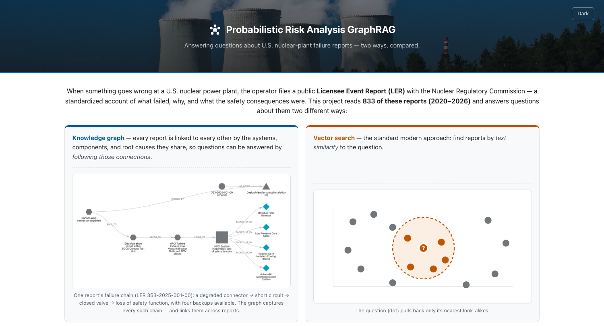
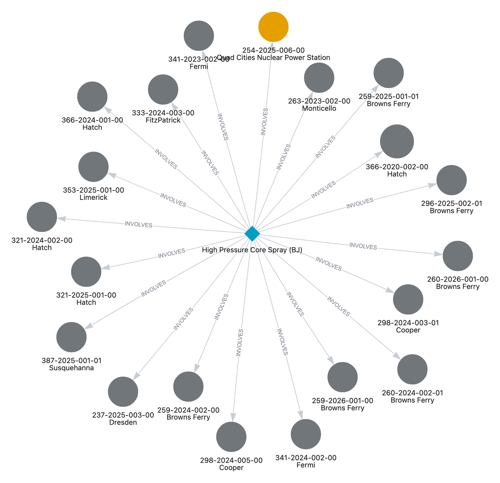
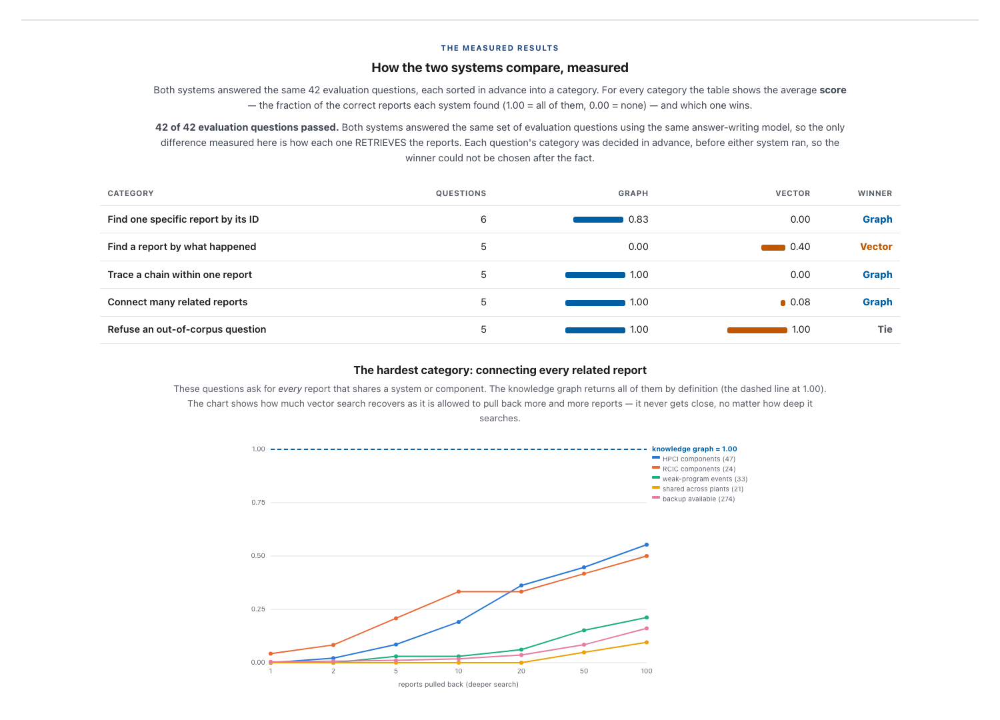
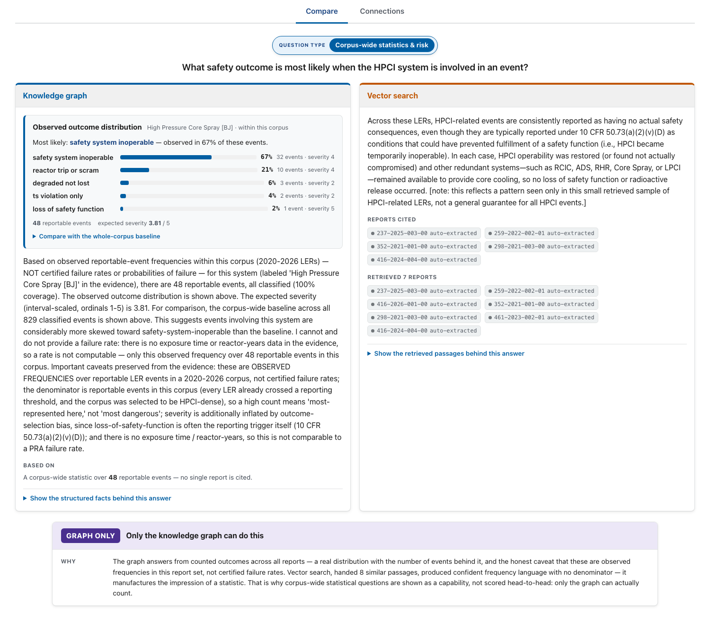

# Probabilistic Risk Analysis GraphRAG

**All federal nuclear-incident reports from 2020 to 2026, restructured into a knowledge graph (12,474 nodes, 17,372 links): trace a plant failure's causal chain, rank the systems that carry the most risk, and answer challenging cross-document questions**

### ▶︎ [**Try the live demo**](https://sahilmulki.github.io/probabilistic-risk-analysis-graphrag/) &nbsp;·&nbsp; runs in your browser, nothing to install



---

## Project Summary

Every time something goes wrong at a U.S. nuclear power plant — a pump fails, a valve sticks, a
safety system trips — the operator is legally required to file a public **Licensee Event Report
(LER)** with the Nuclear Regulatory Commission. Each one is a standardized account of _what failed,
why, and how close it came to mattering for safety._

The useful questions about this data are almost never about a single report. They're about
**patterns across many:**

- _"What components have failed in the high-pressure cooling system — across every plant?"_
- _"Which failures trace back to a weak maintenance program?"_
- _"When this system fails, what safety outcome usually follows?"_

This project builds a **knowledge graph.** It reads all **833 reports**, uses an
LLM to extract the key entities from each (systems, components, root causes, consequences), and links
every report to every other through what they share. Now a question can be answered by _following
those links._

---

## Why a knowledge graph beats search here

The whole idea in one picture. Ask _"What components have failed in the HPCI cooling system across
the whole corpus?"_ — the graph follows one shared link and returns **all ~47 reports across ~15
plants**; vector search, ranking by text similarity, can't assemble a set that's scattered across
documents.



_Each dot is a separate failure report; the center is the one system they all share. The gold node is
a report I hand-checked as a quality-control reference — its origin is tracked all the way into
the visualization, so you can always see what was human-verified vs. machine-extracted._

---

## Results: GraphRAG vs Vector RAG

Both systems answered the **same 42 evaluation questions**, using the **same answer-writing model** —
so the only thing being measured is _how each one retrieves._ Every question was sorted into a
category **in advance**, before either system ran, so no winner could be picked after the fact.

| Question type                           |  Graph   |  Vector  | Winner |
| --------------------------------------- | :------: | :------: | :----: |
| Find one specific report by its ID      | **0.83** |   0.00   | Graph  |
| Find a report by what happened          |   0.00   | **0.40** | Vector |
| Trace a failure chain within one report | **1.00** |   0.00   | Graph  |
| Connect many related reports            | **1.00** |   0.08   | Graph  |
| Refuse an out-of-corpus question        | **1.00** | **1.00** |  Tie   |

_Scores are the fraction of the correct reports each system found (1.00 = all, 0.00 = none)._

Main takeaway: **the graph dominates cross-document and multi-hop questions, vector search
genuinely wins free-form "find the report where X happened,"** and both correctly refuse questions
about things not in the data (e.g. Chernobyl — not a U.S. LER). Showing the category vector _wins_ is
the point because a demo that only shows the graph winning wouldn't be trustworthy.

The gap on the hardest questions is stark: even allowed to pull back **100** reports, vector search
recovers only ~55% of the HPCI components, while the graph returns 100% by construction.



---

## The probabilistic risk layer

Nuclear engineers use **Probabilistic Risk Analysis (PRA)** to reason about how likely different
failure outcomes are. This project adds a layer in that spirit: it classifies every reported outcome
by severity and computes, from how often each outcome _actually occurred_ across the corpus, a
distribution like _"when this system is involved, here's what tends to happen."_

A key engineering principle to this project is **honesty**. These numbers are observed frequencies in one
selected set of reports — **not** certified failure rates — and the system says so, every time: it
shows the full distribution, states the denominator, refuses to invent a
"failure rate" it can't compute, and names the biases baked into the data.



---

## How it's built

A four-stage pipeline turns raw reports into answerable structure:

```
 Raw LER (public NRC filing)
    │
    ▼  EXTRACTION
    │  A deterministic parser reads the structured header/tables (identity, official codes) —
    │  exact, never guessed. An LLM reads only the free-text narrative (the causal chain). The
    │  fragile part is kept small; the factual part stays exact.
    ▼
 Validated record (Pydantic schema: 10 entity types, 11 relationship types)
    │
    ▼  RESOLUTION + GRAPH BUILD
    │  Entities are normalized to the NRC's own equipment codes so the same system across three
    │  reports becomes one shared node, then loaded into Neo4j as one connected graph.
    ▼
 Knowledge graph — 12,474 nodes / 17,372 edges, one connected component, 0 orphans
    │
    ▼  RETRIEVAL + ANSWER
    │  An LLM router maps a question to one of ~11 intents + vetted query templates (no free-form
    │  generated queries), pulls the subgraph, and a second LLM writes a grounded answer that
    │  cites the source reports.
    ▼
 Grounded answer with citations
```

**A few clarifying decisions:**

- **Deterministic-first extraction.** Coded fields are _parsed_, not guessed by the LLM — so the
  identity and official cause codes are exact, and the LLM only does what it's actually good at
  (reading narrative). Extraction scored **node-F1 0.88 / edge-F1 0.72** against a hand-marked answer
  key, and the whole 833-report corpus cost **~$27** to extract (batched LLM calls + prompt caching).
- **No LLM-generated database queries.** Retrieval uses a router constrained to the graph's real
  vocabulary plus reviewed query templates — far more robust than letting an LLM write raw Cypher.
- **A frozen answer key.** The evaluation's ground truth is never edited to flatter the model; the
  full question suite passes **42/42**.
- **One render contract for the web app.** The demo and the live backend produce the _identical_ data
  shape, so the UI code never branches on where the answer came from — and a script proves the demo's
  retrieval is byte-for-byte a fresh live run.

---

## Run it yourself

**Demo mode — zero setup, $0, no backend.** The [live demo](https://sahilmulki.github.io/probabilistic-risk-analysis-graphrag/)
runs entirely in the browser from a bundle of _real, captured_ pipeline output. To run it locally:

```bash
python -m http.server -d web 8000     # then open http://localhost:8000
```

**Live mode — ask your own questions.** Runs both retrievers and the answerer against a live database.
Needs [Neo4j](https://neo4j.com/download/) running and an Anthropic API key in a `.env` file
(~$0.02–0.05 per question).

```bash
pip install -e .                      # installs the `pragraph` package + pinned deps
uvicorn pragraph.app:app              # serves the page + the /ask API at http://localhost:8000
```

The **[demo guide](docs/DEMO_GUIDE.md)** lists every kind of question you can
ask in Live mode, with copy-paste examples and a plain-language vocabulary of real plants, systems, and
causes to drop into your own questions.

<details>
<summary>Rebuild the graph and re-run the evaluation from scratch</summary>

```bash
python -m pragraph.pipeline           # extract + score reports  → out/
python -m pragraph.load_graph         # load into Neo4j (idempotent)
python -m pragraph.ask --golden       # run the full graded question suite
python -m pragraph.precompute         # rebuild the demo bundle from real output, and prove demo ≡ live
```

</details>

---

## Honest scope

The risk figures are observed reportable-event frequencies, not
certified PRA failure rates. It is **not affiliated with or endorsed by the NRC.**

---

## About

Built by **Sahil Mulki** — I built this out of an interest in dynamic probabilistic risk analysis and to learn more about knowledge graphs + GraphRAG.

- [sahilmulki7@gmail.com](mailto:sahilmulki7@gmail.com)
- [LinkedIn](https://www.linkedin.com/in/smulki/)
- Portfolio — _coming soon_

_Data: the public [NRC ADAMS](https://www.nrc.gov/reading-rm/adams.html) library of Licensee Event
Reports (2020–2026), structured per NRC Form 366 and the EIIS equipment-code standards; domain framing
follows NUREG-1022. Masthead photo: royalty-free stock._
